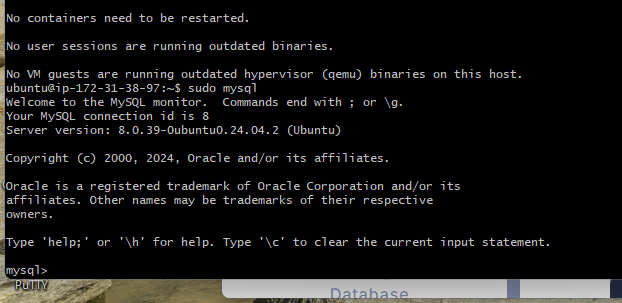

# LEMP Stack Implementation on Ubuntu 20.04

This project document captures my process of implementing a **LEMP Stack** on an Ubuntu 20.04 server. The objective is to configure a web server environment using **Linux, Nginx, MySQL,** and **PHP** to host dynamic websites.

---

## Step 1 — Setting Up the Server

### 1.1 Connecting to the Server

The first step is connecting to the server via SSH. This grants secure access to manage and configure the server.

**Command Used:**
```bash
ssh -i lemp.pem ubuntu@13.48.55.145 
```

> **Screenshot:** 


---

### 1.2 Updating the System Packages

To ensure the server operates with the latest packages, I updated and upgraded the system packages.

**Commands Used:**
```bash
sudo apt update
sudo apt upgrade
```


> **Screenshot:** 

---

### 1.3 Installing Nginx

I proceeded to install Nginx, which is a powerful and efficient web server.

**Command Used:**
```bash
sudo apt install nginx
```

After installation, I checked that Nginx was running and configured it to start on boot.

**Commands Used:**
```bash
sudo systemctl start nginx
sudo systemctl enable nginx
```

> **Screenshot:** 
> **Screenshot:** 
---

### Step 1 Summary

In this step, I successfully set up the server, installed and configured Nginx, and verified its operation. This foundational setup prepares the server for the subsequent steps in the LEMP stack setup.


## Step 2 — Installing MySQL

For this project, I needed a database system, and I opted for **MySQL** due to its robustness and compatibility with many web applications. In this step, I installed MySQL and secured the installation.

### 2.1 Installing MySQL

First, I installed the MySQL server package:

**Command Used:**
```bash
sudo apt install mysql-server
```

> **Screenshot:** 
---

### 2.2 Configuring MySQL Security

To enhance the security of the MySQL installation, I ran the `mysql_secure_installation` command. This command prompted me to set up a root password, remove anonymous users, disallow remote root login, and remove the test database.

**Command Used:**
```bash
sudo mysql_secure_installation
```

During this process, I selected options to:
- Remove anonymous users.
- Disallow remote root login.
- Remove the test database.
- Reload privilege tables to apply changes.

> **Screenshot:** 

---

### 2.3 Testing MySQL

To confirm MySQL was installed and functioning, I logged in using the MySQL client and checked the version.

**Commands Used:**
```bash
sudo mysql
SELECT VERSION();
EXIT;
```

> **Screenshot:** 
---

### Step 2 Summary

In this step, I installed and secured MySQL, creating a solid database foundation for the LEMP stack. This database will support the dynamic data requirements for applications running on this server.

---


## Step 3 — Installing PHP

PHP is essential for processing dynamic content in our LEMP stack. In this step, I installed PHP along with a few additional modules to ensure compatibility with Nginx and MySQL.

### 3.1 Installing PHP and Required Modules

To install PHP, I used the following command to include `php-fpm` (FastCGI Process Manager for Nginx) and `php-mysql` (MySQL extension for PHP):

**Command Used:**
```bash
sudo apt install php-fpm php-mysql
```

> **Screenshot:** 
---

### 3.2 Verifying PHP Installation

To verify that PHP was installed and running correctly, I checked the version of PHP installed using the following command:

**Command Used:**
```bash
php -v
```

The output confirmed that PHP was successfully installed and displayed the current version.


---

### Step 3 Summary

With PHP installed, the LEMP stack now has the capability to handle dynamic processing, which is essential for applications that require server-side scripting. This will allow us to move forward with configuring Nginx to interact seamlessly with PHP.

---


## Step 4 — Configuring Nginx to Use the PHP Processor

In this step, I configured Nginx to work with PHP, allowing it to process PHP files dynamically. This involved setting up a server block specifically for my domain, ensuring all requests to PHP files are properly handled by PHP-FPM.

### 4.1 Creating the Root Web Directory

To keep the directory structure organized, I created a root directory for my domain (`projectLEMP`). This way, Nginx can serve files from a dedicated location.

**Command Used:**
```bash
sudo mkdir /var/www/projectLEMP
```

**Command Used to Set Permissions:**
```bash
sudo chown -R $USER:$USER /var/www/projectLEMP
```

> **Screenshot:** 

---

### 4.2 Setting Up the Nginx Server Block

Next, I created a new server block configuration file for `projectLEMP` in the `sites-available` directory. This file contains settings that direct Nginx to handle requests, use PHP-FPM, and manage error handling.

**Command Used to Create Server Block File:**
```bash
sudo nano /etc/nginx/sites-available/projectLEMP
```

**Configuration Added:**
```nginx
server {
    listen 80;
    server_name projectLEMP www.projectLEMP;
    root /var/www/projectLEMP;

    index index.html index.htm index.php;

    location / {
        try_files $uri $uri/ =404;
    }

    location ~ \.php$ {
        include snippets/fastcgi-php.conf;
        fastcgi_pass unix:/var/run/php/php7.4-fpm.sock;
    }

    location ~ /\.ht {
        deny all;
    }
}
```


> **Screenshot:** 
---

### 4.3 Activating the New Server Block

To enable this new server block, I created a symbolic link from the `sites-available` directory to `sites-enabled` and removed the default configuration file.

**Commands Used:**
```bash
sudo ln -s /etc/nginx/sites-available/projectLEMP /etc/nginx/sites-enabled/
sudo unlink /etc/nginx/sites-enabled/default
```


> **Screenshot:** 
---

### 4.4 Testing and Reloading Nginx

I tested the new configuration to check for syntax errors before reloading Nginx.

**Commands Used:**
```bash
sudo nginx -t
sudo systemctl reload nginx
```

> **Screenshot:** 
---

### 4.5 Creating a Test PHP File

Finally, I created an `index.html` file in the `/var/www/projectLEMP` directory to confirm that the server block works as expected.

**Command Used:**
```bash
nano /var/www/projectLEMP/index.html
```

**HTML Content Added:**
```html
<html>
  <head>
    <title>projectLEMP</title>
  </head>
  <body>
    <h1>Hello World!</h1>
    <p>This is the landing page of <strong>projectLEMP</strong>.</p>
  </body>
</html>
```

> **Screenshot:** 
---

### Step 4 Summary

After completing this step, I configured Nginx to handle PHP requests using PHP-FPM and set up a dedicated directory structure for my domain. The test HTML file confirmed the setup was successful, and Nginx is now serving content from the new server block.

---

## Step 5 — Testing PHP with Nginx

In this step, I verified that PHP is functioning correctly with Nginx by creating a simple PHP file in the root directory. This test confirms that the server processes PHP files as expected, displaying PHP-generated content instead of raw code.

### 5.1 Creating a Test PHP File

To test the PHP setup, I created a `info.php` file in `/var/www/projectLEMP`. This file runs the `phpinfo()` function, which provides information about the PHP configuration on the server.

**Command Used:**
```bash
nano /var/www/projectLEMP/info.php
```

**PHP Code Added:**
```php
<?php
phpinfo();
?>
```


> **Screenshot:** 
---

### 5.2 Accessing the PHP Info Page

With the file created, I accessed `http://projectLEMP or_IP/info.php` in a web browser. The page displayed detailed PHP configuration information, confirming that PHP is working properly with Nginx.

> **Screenshot:** 
---

### 5.3 Removing the Test PHP File

For security reasons, it’s best not to leave the `info.php` file accessible on the server. After confirming PHP is working, I deleted the file.

**Command Used:**
```bash
rm /var/www/projectLEMP/info.php
```

---

### Step 5 Summary

By creating and testing the `info.php` file, I confirmed that PHP is correctly configured and running with Nginx. Removing the file afterward was an essential security measure.

---


# Step 6 — Testing Database Connection from PHP

In this step of my project, I focused on creating a new MySQL user and database for the application. This step is crucial for setting up the LEMP stack, as it enables secure interaction between the web application and the database.

## Instructions Followed

1. **Log into MySQL**: I accessed the MySQL console as the root user by running the following command in the terminal:
   ```bash
   sudo mysql
   ```

2. **Create a New Database**: After logging in, I created a new database. I replaced `your_database_name` with my chosen name:
   ```sql
   CREATE DATABASE example_database;
   ```

3. **Create a New User**: Next, I created a new MySQL user. I replaced `your_username` and `your_password` with my selected username and password:
   ```sql
   CREATE USER 'example_user'@'localhost' IDENTIFIED WITH mysql_native_password BY 'Password.1';
   ```

4. **Grant Privileges**: I granted this user full privileges on the newly created database to ensure proper access:
   ```sql
   GRANT ALL PRIVILEGES ON example_database.* TO 'example_user'@'localhost';
   ```

5. **Flush Privileges**: To apply all changes, I executed the following command:
   ```sql
   FLUSH PRIVILEGES;
   ```

6. **Exit MySQL**: Finally, I exited the MySQL console by running:
   ```sql
   EXIT;
   ```

## Screenshot

Below is a screenshot of the commands I executed in the MySQL console:


This process successfully created a new MySQL user and database, allowing my application to connect securely to the database.

